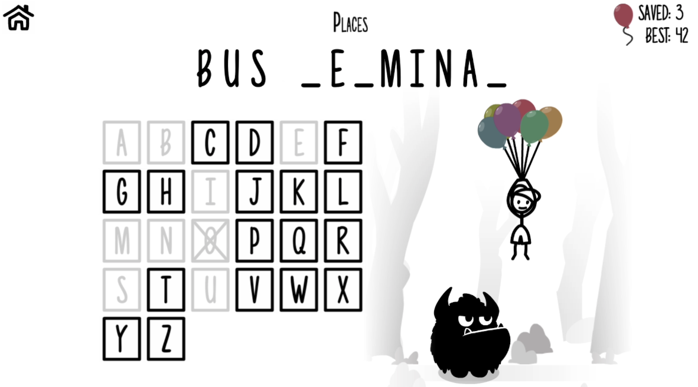

hangman

# Challenge requirement

For this coding test, your mission is to write an algorithm that plays the game of Hangman through their API server. 

You are required to write a “guess” function that takes current word (with underscores) as input and returns a guess letter. You will use the API codes below to play 1,000 Hangman games. You have the opportunity to practice before you want to start recording your game results.Your algorithm is permitted to use a training set of approximately 250,000 dictionary words. 

Your algorithm will be tested on an entirely disjoint set of 250,000 dictionary words. Please note that this means the words that you will ultimately be tested on do NOT appear in the dictionary that you are given. You are not permitted to use any dictionary other than the training dictionary we provided. This requirement will be strictly enforced by code review.You can use the command below to play up to 100,000 practice games.

In this challenge,you are offered practice api and finalapi，the practise api only have a usage limit of 100k.So I decide to to split my mission into three part:
1,develop a hangman programme to simulate 2,develop an hangman algorithm 3,Try my best to Tune the algo until the deadline. 

# My first try
I Use the default algo to get about 18%.The default algo use the letter probability of all words to play the game. 

After that i choose conditional probability instead of total probability to get about 20%.It shows that the guessed letter's impact on the unguessed letter's probability.

# Analysis
The challenge means that we should guess the word based on the length of the word.After we successfully guessed letter within the word,we have more information to guess the next letter.
Each time we only have one letter to guess.The results will be right or wrong.If the result is wrong we will guess the second most possible letter.If the result is right we will guess next letter based on the new infomation.

So let me play the hangman challenge by manual.
IF we were given a placeholder which have length n, the only infomation we can utilize to guess the first letter is the length.So generally we guess the most possible letter basing on the word length n. So actually we guess the most common letter such as 'e' or 'i'.
Then we begin our guessing.If we successfully guessed one letter from the word and the letter only take one place in the placeholder,we will guess the next possible letter based on our algorithm.
Then repeat.
Then we will find we have guessed most of letter from the word and there are only a few empty space in the placeholder.At that time,we will guess the letter based on existing infomation generated by other letters.

# principle analysis
After analysis we can generate one function:
p_i = p_database + p_letter 
p_database means the probability from the big data ,we will guess the most common word from the 250000 dictionary words.
p_letter means the probability from other existing letter

We can assume that every letter have a probability p_i and we guess the letter with the biggest probability.

Then we begin our EDA(extensive data analysis)

EDA.ipynb

We can find the hidden rules from our analysis.
1,The most common letter differs from words with different length.But the commonality is similar with the nearest length's words.
2,other words not only influence the p_letter,but also will influence the p_database.for example word without letter e have a better chance to have letter a
3,Different place have different letter probability, first 2 letter and last 2 letter shows a significant different situation because of the influence of prefix and suffix.

# pros and cons
We have a correctness of 60%

# result analysis
After analysis of  i find out the 

# improvment
To improve